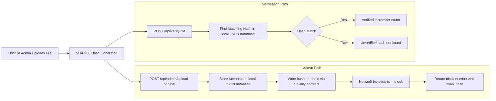

# Blockchain File Integrity Checker

Blockchain-backed integrity verification for any file type.

This project is a full-stack app where an admin registers reference files and users verify uploaded files against those registered hashes. Each registration is recorded on an EVM chain via a Solidity contract (Hardhat for local development), so integrity evidence is auditable and tamper-evident.

## What This Project Is

- A blockchain-backed file integrity checker for any file format.
- Works with any file format (PDF, image, document, archive, etc.).
- Uses SHA-256 hashes plus blockchain-style block linking for traceability.

## Key Features

- File hash registration and verification using SHA-256.
- Solidity-based on-chain file hash registry.
- Hardhat local chain support for development.
- Blockchain explorer data (blocks, mempool, chain stats).
- Admin workflow for managing registered reference files.
- User workflow for checking whether a file matches a registered original.
- EVM anchoring for file hashes through a Solidity contract.

## Tech Stack

- Backend: Node.js, Express, Multer, local JSON storage
- Frontend: React, Vite, Tailwind CSS, Axios
- Crypto: SHA-256 hashing via Node crypto APIs
- Chain tooling: Hardhat, Ethers, Solidity

## Project Structure

```text
.
├── server/              # API and EVM web3 service
├── client/              # React frontend
├── contracts/           # Solidity smart contract
├── scripts/             # Hardhat deploy script
├── data/                # Local data storage
├── hardhat.config.cjs   # Hardhat network/compiler config
├── .env.example         # Environment template
├── start.sh             # Convenience startup script
└── test-demo.sh         # API demo script
```

## Setup

### Prerequisites

- Node.js 18+
- npm

### Install Dependencies

```bash
npm install
cd client && npm install && cd ..
```

### Configure Environment

```bash
cp .env.example .env
```

Use Hardhat local chain values in `.env` for local development:

- ENABLE_WEB3_ANCHORING=true
- WEB3_CHAIN_ID=31337
- WEB3_RPC_URL=http://127.0.0.1:8545
- WEB3_PRIVATE_KEY=<hardhat account private key>
- WEB3_CONTRACT_ADDRESS=<deployed_contract_address>

For quick local setup, you can run deploy with env auto-write:

```bash
npm run chain:node
npm run chain:deploy:local:enable
```

### Run in Development

```bash
npm run dev
```

Before starting the app stack, make sure the local Hardhat node is running and the contract has been deployed.

This starts:

- Backend: http://localhost:5000
- Frontend: http://localhost:3000

Notes:

- In development, backend can run even when client/dist is missing.
- In production-style serving from backend, build frontend first using npm run build.

### Other Useful Commands

```bash
# Start local hardhat node
npm run chain:node

# Deploy contract to local node
npm run chain:deploy:local:enable

# Run backend only
npm run server

# Run frontend only
npm run client

# Build frontend
npm run build

# Compile smart contract
npm run chain:compile

# Deploy to local node
npm run chain:deploy:local

# Deploy locally and auto-enable Web3 in .env
npm run chain:deploy:local:enable

# Deploy to Sepolia
npm run chain:deploy:sepolia

# Alternative startup script
chmod +x start.sh && ./start.sh
```

## Basic Usage

1. Open the app in the browser.
2. Admin logs in and uploads a reference file.
3. User uploads a file to verify integrity.
4. System compares hashes and returns verified/unverified status.
5. Blockchain stats and block data can be inspected from the UI/API.

Default admin key in this demo: `admin123`

## Workflow Chart



The chart highlights the core timeline: upload -> hash -> register or verify.

## API Overview

### Admin

- `POST /api/admin/upload-original` - Register reference file and anchor hash on-chain.
- `GET /api/admin/originals` - List registered files.
- `DELETE /api/admin/originals/:fileHash` - Remove a registered file.

### User Verification

- `POST /api/verify-file` - Upload a file and verify against registered originals.
- `GET /api/files/registered` - List registered files for user view.

### Blockchain / Diagnostics

- `GET /api/blockchain` - Chain snapshot and stats from connected network.
- `GET /api/block/:index` - Detailed block info.
- `GET /api/mining-stats` - Timing/difficulty history from recent blocks.
- `GET /api/mempool` - Pending contract transactions.
- `GET /api/verify-blockchain/:depth` - Link validation for recent blocks.

### Web3

- `GET /api/web3/status`
- `GET /api/web3/verify/:fileHash`

## Notes

- This is a local/demo environment and uses a simple admin key check.
- For production use, replace admin auth with proper identity and authorization.
- Persisted data and uploaded files are stored locally under `data/`.
- Hardhat/EVM anchoring is implemented at backend/contract level, so existing frontend screens remain unchanged.

## 2-Minute Local Blockchain Proof (5 Commands)

Use this to demonstrate proper blockchain connection using a local Hardhat chain.

1) `cp .env.example .env`
2) `npm run chain:node`
3) `npm run chain:deploy:local:enable`
4) `npm run server`
5) `curl -s http://localhost:5000/api/web3/status | jq .`

Expected result from command 5: `enabled: true` and `ready: true`.

If you use a remote chain, update `WEB3_RPC_URL`, `WEB3_PRIVATE_KEY`, `WEB3_CHAIN_ID`, and `WEB3_CONTRACT_ADDRESS` accordingly.